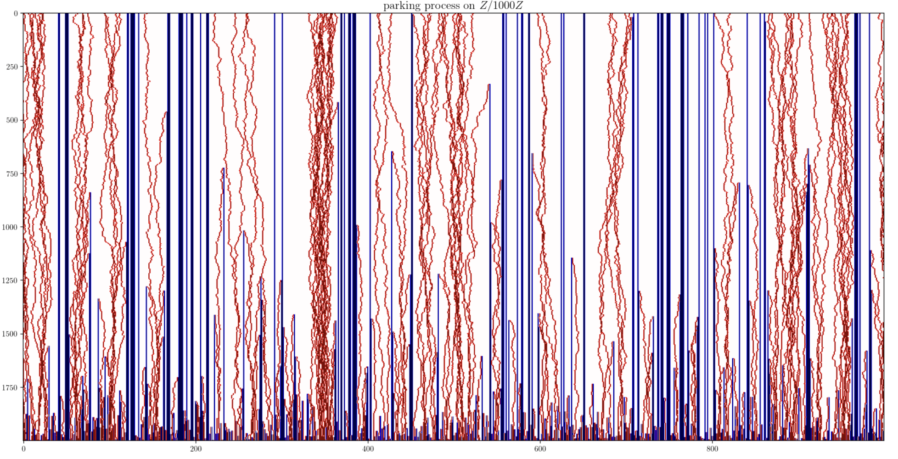

## Parking processes simulation 

Place a car independently with probability p at each site of a graph. Each initially vacant site is a parking spot that can fit one car. Cars simultaneously perform independent random walks. When a car encounters an available parking spot it parks there. Other cars can still drive over the site, but cannot park there. If two cars collide, depending on the type of parking process, the following outcomes are possible: (1) nothing happens and cars keep moving; (2) cars coalease into one car; (3) cars annihilate each other. 

&nbsp;

## Authors

* **Jacob Richey** - *Initial work* - [Website](https://personal.math.ubc.ca/~jfrichey/)
* **Lily Reeves** - *Initial work* - [Website](https://www.cam.cornell.edu/research/grad-students/lily-reeves)
* **Hanbaek Lyu** - *Initial work* - [Website](https://hanbaeklyu.com)
* **Matthew Junge** - *Initial work* - [Website](https://www.mathjunge.com)

## License

This project is licensed under the MIT License - see the [LICENSE.md](LICENSE.md) file for details

